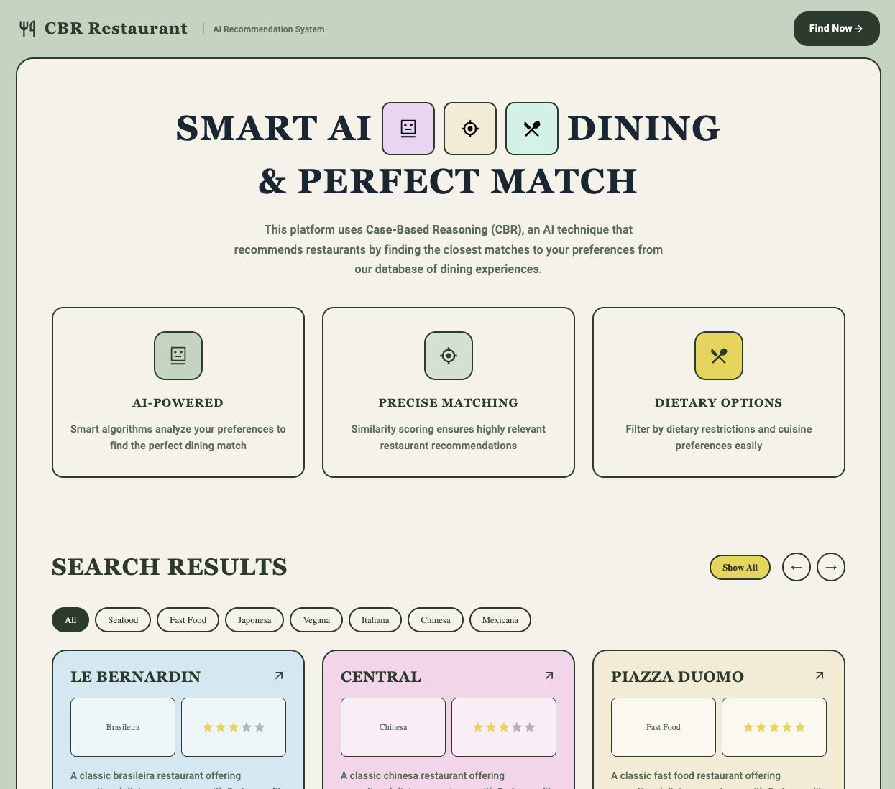

# Restaurant Recommendation System using Case-Based Reasoning (CBR)

A restaurant recommendation system that implements **Case-Based Reasoning (CBR)**, an artificial intelligence technique that solves new problems by retrieving and adapting solutions from similar past experiences stored in a case base.



## Table of Contents

- [Overview](#overview)
- [Case-Based Reasoning Algorithm](#case-based-reasoning-algorithm)
  - [The CBR Cycle](#the-cbr-cycle)
  - [Similarity Calculation](#similarity-calculation)
  - [Attribute Weights](#attribute-weights)
  - [Cuisine Similarity Matrix](#cuisine-similarity-matrix)
  - [Mathematical Formulation](#mathematical-formulation)
- [Installation](#installation)
- [Running the Application](#running-the-application)
  - [Using Docker (Recommended)](#using-docker-recommended)
  - [Using npm/yarn](#using-npmyarn)
- [Project Structure](#project-structure)
- [API Endpoints](#api-endpoints)
- [Contributing](#contributing)

---

## Overview

This project demonstrates how to solve recommendation problems based on past experiences. When a user specifies their preferences (cuisine type, price range, dietary restrictions, etc.), the system finds the most similar restaurants from the case base using weighted similarity scoring.

**Tech Stack:**
- **Frontend:** React with Material-UI
- **Backend:** Express.js with Node.js
- **Database:** MongoDB
- **Containerization:** Docker & Docker Compose

---

## Case-Based Reasoning Algorithm

### The CBR Cycle

Case-Based Reasoning follows a cyclical process known as the **4R Cycle**:

```
┌─────────────────────────────────────────────────────────────────┐
│                        CBR CYCLE (4Rs)                          │
├─────────────────────────────────────────────────────────────────┤
│                                                                 │
│    ┌──────────┐      ┌──────────┐      ┌──────────┐            │
│    │ RETRIEVE │ ───► │  REUSE   │ ───► │  REVISE  │            │
│    └──────────┘      └──────────┘      └──────────┘            │
│         ▲                                    │                  │
│         │            ┌──────────┐            │                  │
│         └─────────── │  RETAIN  │ ◄──────────┘                  │
│                      └──────────┘                               │
│                                                                 │
└─────────────────────────────────────────────────────────────────┘
```

| Phase | Description |
|-------|-------------|
| **Retrieve** | Find cases in the case base most similar to the new problem (user preferences) |
| **Reuse** | Adapt the retrieved solutions to fit the current problem |
| **Revise** | Evaluate the proposed solution and refine if necessary |
| **Retain** | Store the new experience in the case base for future use |

In this implementation, we focus primarily on the **Retrieve** phase, using similarity-based retrieval to find the best matching restaurants.

### Similarity Calculation

The system calculates a **Global Similarity Score** between user preferences and each restaurant case using a weighted sum of local similarities:

```
Global Similarity = Σ (wᵢ × local_simᵢ)
```

Where:
- `wᵢ` = weight of attribute i
- `local_simᵢ` = local similarity score for attribute i (0 to 1)

### Attribute Weights

Each attribute has an assigned weight reflecting its importance in the recommendation:

| Attribute | Weight | Priority | Description |
|-----------|--------|----------|-------------|
| `glutenFree` | 0.999 | Highest | Gluten-free dietary restriction |
| `sugarFree` | 0.999 | Highest | Sugar-free dietary restriction |
| `lactoseFree` | 0.999 | Highest | Lactose-free dietary restriction |
| `soyFree` | 0.999 | Highest | Soy-free dietary restriction |
| `price` | 0.675 | High | Price range preference |
| `cuisineType` | 0.6125 | High | Type of cuisine |
| `rating` | 0.5125 | Medium | Restaurant rating |
| `thematic` | 0.275 | Low | Themed restaurant preference |

**Rationale:** Dietary restrictions have the highest weight (0.999) because they represent hard constraints—recommending a restaurant that doesn't meet dietary needs could have serious health implications.

### Cuisine Similarity Matrix

The system uses a **Local Similarity Matrix** to compare cuisine types. This matrix captures domain knowledge about how similar different cuisines are:

| | Seafood | Fast Food | Japanese | Vegan | Italian | Chinese | Mexican | Healthy | Brazilian | Vegetarian | Arabic |
|---|:---:|:---:|:---:|:---:|:---:|:---:|:---:|:---:|:---:|:---:|:---:|
| **Seafood** | 1.0 | 0.4 | 0.8 | 0.4 | 0.2 | 0.7 | 0.3 | 0.8 | 0.4 | 0.6 | 0.2 |
| **Fast Food** | 0.4 | 1.0 | 0.3 | 0.0 | 0.3 | 0.4 | 0.7 | 0.4 | 0.0 | 0.3 | 0.2 |
| **Japanese** | 0.8 | 0.3 | 1.0 | 0.8 | 0.1 | 0.8 | 0.3 | 0.8 | 0.4 | 0.6 | 0.1 |
| **Vegan** | 0.4 | 0.0 | 0.8 | 1.0 | 0.2 | 0.6 | 0.3 | 0.9 | 0.4 | 0.8 | 0.3 |
| **Italian** | 0.2 | 0.3 | 0.1 | 0.2 | 1.0 | 0.3 | 0.4 | 0.3 | 0.4 | 0.4 | 0.1 |
| **Chinese** | 0.7 | 0.4 | 0.8 | 0.6 | 0.3 | 1.0 | 0.3 | 0.6 | 0.3 | 0.7 | 0.2 |
| **Mexican** | 0.3 | 0.7 | 0.3 | 0.3 | 0.4 | 0.3 | 1.0 | 0.4 | 0.4 | 0.4 | 0.7 |
| **Healthy** | 0.8 | 0.4 | 0.8 | 0.9 | 0.3 | 0.6 | 0.4 | 1.0 | 0.4 | 0.9 | 0.3 |
| **Brazilian** | 0.4 | 0.0 | 0.4 | 0.4 | 0.4 | 0.3 | 0.4 | 0.4 | 1.0 | 0.4 | 0.3 |
| **Vegetarian** | 0.6 | 0.3 | 0.6 | 0.8 | 0.4 | 0.7 | 0.4 | 0.9 | 0.4 | 1.0 | 0.2 |
| **Arabic** | 0.2 | 0.2 | 0.1 | 0.3 | 0.1 | 0.2 | 0.7 | 0.3 | 0.3 | 0.2 | 1.0 |

**Key observations:**
- Japanese ↔ Chinese: 0.8 (high similarity due to Asian cuisine characteristics)
- Vegan ↔ Healthy: 0.9 (both emphasize health-conscious options)
- Fast Food ↔ Vegan: 0.0 (opposite dining philosophies)

### Mathematical Formulation

#### Global Similarity Function

For a user query `Q` and a case `C` in the case base, the global similarity is:

```
Sim(Q, C) = Σᵢ₌₁ⁿ wᵢ × simᵢ(qᵢ, cᵢ)
```

Where:
- `n` = number of attributes
- `wᵢ` = weight of attribute i
- `simᵢ(qᵢ, cᵢ)` = local similarity between query attribute and case attribute

#### Local Similarity Functions

**1. Boolean Attributes (Dietary Restrictions, Thematic)**
```
sim(q, c) = { 1  if q = c
            { 0  if q ≠ c
```

**2. Numeric Attributes with Tolerance (Price)**
```
sim(q, c) = { 1  if c_min ≤ q ≤ c_max
            { 0  otherwise

where:
  c_min = c × (1 - tolerance)
  c_max = c × (1 + tolerance)
  tolerance = 0.30 (30%)
```

**3. Symbolic Attributes (Cuisine Type)**
```
sim(q, c) = SimilarityMatrix[cuisine_q][cuisine_c]
```

#### Example Calculation

Given user preferences:
- Cuisine: Japanese
- Price: $45
- Gluten-Free: true
- Rating: 4

And a restaurant case:
- Cuisine: Chinese
- Price: $50 (tolerance range: $35-$65)
- Gluten-Free: true
- Rating: 4

```
Similarity Calculation:
─────────────────────────────────────────
Attribute     Weight   Local Sim   Score
─────────────────────────────────────────
cuisineType   0.6125   0.8         0.490
price         0.675    1.0         0.675
glutenFree    0.999    1.0         0.999
rating        0.5125   1.0         0.5125
─────────────────────────────────────────
TOTAL                              2.6765
```

---

## Installation

### Prerequisites

- Node.js (v14+)
- npm or yarn
- Docker & Docker Compose (for containerized setup)
- MongoDB (for local setup without Docker)

### Clone the Repository

```bash
git clone https://github.com/your-username/restaurant-recommendation-system.git
cd restaurant-recommendation-system
```

---

## Running the Application

### Using Docker (Recommended)

The easiest way to run the complete application stack (MongoDB, Express API, React frontend):

**Development Environment:**
```bash
# 1. Copy and configure environment variables
cd script/dev
cp .env.sample .env
# Edit .env and set MONGO_DB_PASSWORD

# 2. Start all services
./run-dev.sh

# Or manually with docker-compose
docker-compose up --build
```

**Production Environment:**
```bash
# 1. Copy and configure environment variables
cd script/prod
cp .env.sample .env
# Edit .env and set secure MONGO_DB_PASSWORD

# 2. Start all services in production mode
./run-prod.sh

# Or manually with docker-compose
docker-compose up --build -d
```

**Services will be available at:**
| Service | URL |
|---------|-----|
| React Frontend | http://localhost:3001 |
| Express API | http://localhost:3000 |
| MongoDB | localhost:27017 |

**Stop the services:**
```bash
docker-compose down
```

### Using npm/yarn

**1. Install Dependencies**

```bash
# Install all dependencies
npm install ./express-app && npm install ./react-app

# Or using yarn
cd express-app && yarn install
cd ../react-app && yarn install
```

**2. Configure Environment Variables**

Create a `.env` file in the root directory:

```env
DB_USER=your_mongodb_user
DB_PASSWORD=your_mongodb_password
MONGO_HOST=localhost
MONGO_DB_DATABASE=ia-hawk
```

**3. Start MongoDB**

Make sure MongoDB is running locally on port 27017.

**4. Start the Backend (Express API)**

```bash
# From root directory
npm run server

# Or from express-app directory
cd express-app
npm run start
```

The API will be available at `http://localhost:3000`

**5. Start the Frontend (React)**

```bash
cd react-app

# Development mode
npm run start-js

# Or with SCSS compilation
npm run start
```

The frontend will be available at `http://localhost:3001`

---

## Project Structure

```
restaurant-recommendation-system/
├── express-app/                 # Backend API
│   ├── controller/
│   │   ├── inference.js         # CBR algorithm implementation
│   │   ├── similarityInferenceMatrix.js  # Cuisine similarity matrix
│   │   └── variablesWeight.js   # Attribute weights
│   ├── data/
│   │   └── db.js               # Restaurant seed data
│   ├── routes/
│   │   └── index.js            # API routes
│   └── app.js                  # Express app configuration
├── react-app/                   # Frontend
│   ├── src/
│   │   ├── components/         # React components
│   │   └── App.jsx             # Main application
│   └── public/
├── script/
│   ├── dev/                    # Development Docker config
│   │   ├── docker-compose.yml
│   │   └── mongo-initdb/       # MongoDB initialization
│   └── prod/                   # Production Docker config
├── run-dev.sh                  # Development startup script
├── run-prod.sh                 # Production startup script
└── README.md
```

---

## API Endpoints

| Method | Endpoint | Description |
|--------|----------|-------------|
| `GET` | `/` | Retrieve all restaurants from the case base |
| `POST` | `/` | Get restaurant recommendations based on user preferences |

### POST Request Body

```json
{
  "cuisineType": "Japanese",
  "price": 50,
  "glutenFree": false,
  "sugarFree": false,
  "lactoseFree": false,
  "soyFree": false,
  "thematic": false,
  "rating": 4
}
```

### Response

Returns an array of restaurants sorted by similarity score (highest first).

---

## Contributing

1. Fork the repository
2. Create your feature branch (`git checkout -b feature/amazing-feature`)
3. Commit your changes (`git commit -m 'Add amazing feature'`)
4. Push to the branch (`git push origin feature/amazing-feature`)
5. Open a Pull Request

---

## References

- Aamodt, A., & Plaza, E. (1994). Case-Based Reasoning: Foundational Issues, Methodological Variations, and System Approaches. *AI Communications*, 7(1), 39-59.
- Kolodner, J. (1993). *Case-Based Reasoning*. Morgan Kaufmann Publishers.
- Watson, I. (1999). *Case-based reasoning is a methodology not a technology*. Knowledge-Based Systems, 12(5-6), 303-308.

---

## License

This project is open source and available under the [MIT License](LICENSE).
